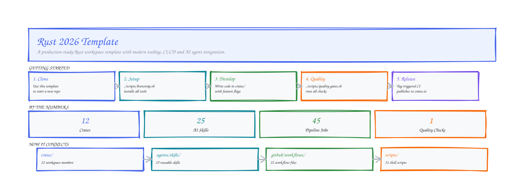

# Rust 2026 Template

[](https://github.com/d-oit/rust-2026-template/actions/workflows/ci.yml)
[](https://codecov.io/gh/d-oit/rust-2026-template)
[](LICENSE)
[](https://www.rust-lang.org)

**Latest release: v0.3.4** — see [`.template/CHANGELOG-TEMPLATE.md`](.template/CHANGELOG-TEMPLATE.md) for the full changelog.

<!-- cargo-sync-readme start -->

A production-ready Rust workspace template with modern tooling, CI/CD and AI agent integration.

## Overview



This template is designed for Rust developers who want to start new projects with best practices baked in. It provides a modular workspace structure, comprehensive quality gates, and built-in support for AI-assisted development.

## Features

- **Rust 2024 Edition:** Leverages the latest language features and idioms with an MSRV of 1.88.
- **Workspace Layout:** Clean separation of concerns with a `crates/` directory for internal libraries and applications.
- **Security First:** Pre-configured supply chain audits, secret scanning, and hardened configuration patterns.
- **Performance Optimized:** Optimized dev profiles with reduced debug artifacts and disk space savings.
- **AI-Native:** First-class support for AI coding agents with specialized skills and canonical instruction sets. Includes `llms.txt` for machine-readable project context.

## Example

```rust,no_run

let result = add(2, 3);
assert_eq!(result, 5);
```

<!-- cargo-sync-readme end -->

## Documentation Map

This repository uses a layered documentation strategy to serve both human developers and AI agents:

| Layer | File / Directory | Audience | Purpose |
|-------|------------------|----------|---------|
| **Human Onboarding** | `README.md`, `QUICKSTART.md` | Humans | High-level project overview and setup |
| **Agent Contract** | `AGENTS.md` | AI Agents | Canonical rules and project contract (SSOT) |
| **Reusable Procedures** | `.agents/skills/` | AI Agents | Step-by-step executable task knowledge |
| **Tool Adapters** | `CLAUDE.md`, `.cursorrules`, etc. | Specific Tools | Tool-specific deltas and harness quirks |

## Included Tooling

- **Testing:** `cargo-nextest` for faster test execution and `proptest` for property-based testing.
- **Quality Assurance:** `cargo-mutants` for mutation testing and `clippy` with a zero-warnings policy. The template includes a pre-configured workspace-level lint suite that prevents common pitfalls like `unwrap()` in library code.
- **CI/CD:** Multi-stage GitHub Actions for linting, testing, security audits, and automated releases.
- **Local Workflows:** Helper scripts for running the entire quality gate pipeline locally.

## Quick Start

1. **Use this Template:** Click the **"Use this template"** button on GitHub.
2. **Setup:** Follow the detailed instructions in **[QUICKSTART.md](QUICKSTART.md)**.
3. **Customize:** Rename the placeholder crates and update `Cargo.toml` metadata.
4. **Develop:** Use `./scripts/quality-gates.sh` to ensure your changes meet the project's quality standards.

## Repository Structure

```text
.
├── .agents/             # AI agent specialized skills and workflow definitions
│   ├── context/         # Cross-repo context for derived repositories
│   └── skills/          # Executable task knowledge and canonical workflows
├── .cargo/              # Cargo configuration (linker, profiles, aliases)
├── .codacy/             # Codacy static analysis and agent review configs
├── .github/             # GitHub Actions workflows and issue templates
├── agents-docs/         # Detailed documentation for AI agents
├── config/              # Profile-based runtime configuration
│   └── profiles/        # Environment-specific JSON configs (default.json, etc.)
├── crates/              # Workspace members (libraries and applications)
│   ├── actor-runtime-template/
│   ├── checkpoint-template/
│   ├── example-crate/   # Placeholder library crate
│   ├── example-registry-pattern/
│   ├── example-storage-pattern/
│   ├── hybrid-storage-template/
│   ├── mcp-server-template/
│   └── sample-app/      # Reference application implementing best practices
├── examples/            # Example usage of workspace crates
│   └── hello_world/ # Simple hello world example
├── reports/             # Generated HTML review and analysis output (ignored)
├── schema/              # JSON Schema definitions for config/API contracts
├── scripts/             # Automation scripts for quality gates and releases
├── AGENTS.md            # Canonical instructions for AI coding agents
├── llms.txt             # LLM context file (machine-readable project overview)
├── Cargo.toml           # Workspace manifest
└── QUICKSTART.md        # Comprehensive setup guide
```

## CI/CD and Quality Gates

The project enforces high standards through a multi-layered verification process:

- **CI Pipeline:** Automatically runs formatting checks, Clippy lints, tests, security audits (`cargo-audit`), supply chain checks (`cargo-deny`), benchmarks compile-check, and VERSION consistency checks on every PR.
- **Local Gates:** Run `./scripts/quality-gates.sh` before committing to mirror the CI checks locally.
- **Mutation Testing:** Periodic runs of `cargo-mutants` verify that your tests actually catch bugs.

## Feature Flags

The root package has no optional features (it only exports a tiny example API).
Real feature flags live on member crates that implement them, for example:

| Crate | Feature | Description |
|-------|---------|-------------|
| `example-storage-pattern` | `sqlite` / `mock` | **Preferred** trait-only storage pattern |
| `hybrid-storage-template` | (none / `MemoryBackend`) | Working in-memory hybrid wrapper |
| `hybrid-storage-template` | `sqlite` | Fail-closed SQLite **stub** (not production) |
| `hybrid-storage-template` | `kv` | redb key-value backend |

Pattern selection: [docs/patterns/README.md](docs/patterns/README.md). For a slim
app workspace, run `./scripts/init-template.sh --minimal …`.

## Benchmarks

The template provides a dedicated `benchmarks/` workspace crate with Criterion benchmark suites (`end_to_end`, `memory_usage`).

See **[QUICKSTART.md](QUICKSTART.md)** for detailed benchmark and performance testing instructions.

## Fuzz Testing

A fuzz testing scaffold is included using `cargo-fuzz`. The fuzzer runs weekly via GitHub Actions.

See the **Advanced Testing** section in **[QUICKSTART.md](QUICKSTART.md)** for local usage instructions.

## AI Assistant Context Files

This template ships structured context files for AI coding assistants. These files help agents understand the project structure and rules quickly.

- **`llms.txt`**: Condensed project overview for token-efficient LLM context.
- **`llms-full.txt`**: Complete source context for deep analysis (auto-generated).

See **[AGENTS.md](AGENTS.md)** for instructions on maintaining and using these context files.

## Output Artifacts

The project uses several directories for generated artifacts and documentation:

- **`reports/`**: Standardized directory for generated HTML reports (coverage, audit, benchmarks). This directory is git-ignored by default.
- **`.agents/ci/`**: CI health status artifacts (ci-status.json, ci-summary.md).
- **`target/`**: Rust build artifacts.

## VERSION File

A `VERSION` file at the repo root serves as a plain-text single source of truth for tooling that can't easily parse TOML.

> **Versioning note:** `VERSION` is the generated project starter version; `.template/CHANGELOG-TEMPLATE.md` is internal to the template - see #135.

```bash
VERSION=$(cat VERSION)
echo "Building version $VERSION"
```

The CI pipeline verifies `VERSION` content matches `Cargo.toml` on every push to main.

## Customization Guidance

To adapt this template to your needs:

- **Renaming Crates:** Search and replace `example-crate` and `sample-app` with your desired crate names.
- **Adjusting Lints:** Modify `.clippy.toml` or crate-level attributes if you need to diverge from the default pedantic lint set.
- **Security Policy:** Review `deny.toml` to customize allowed licenses and dependency bans.

## Maintenance

Contributions are welcome! Please refer to **[CONTRIBUTING.md](CONTRIBUTING.md)** for guidelines on how to propose changes or report issues. Security vulnerabilities should be reported according to the process in **[SECURITY.md](SECURITY.md)**.

## License

This project is licensed under the MIT License - see the [LICENSE](LICENSE) file for details.
