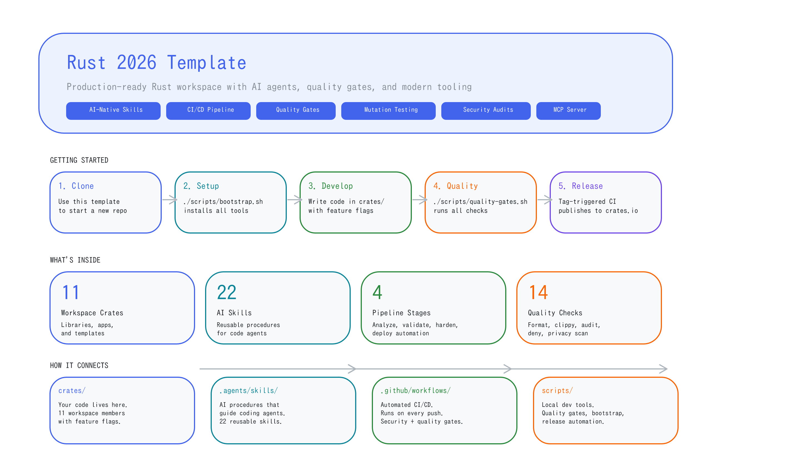
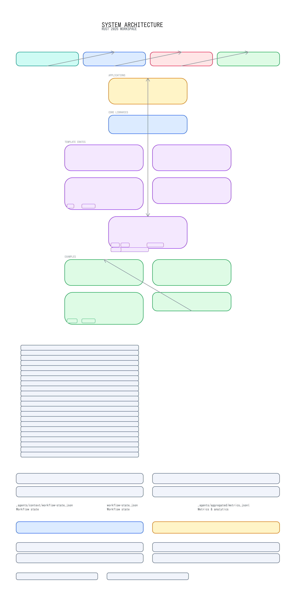
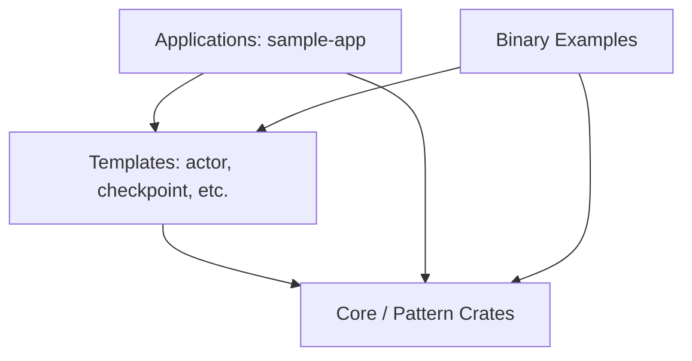

# Architecture

## Overview Diagram

A human-friendly overview of the project — what it is, how to get started, and what's inside.



## Technical Architecture

The detailed system architecture showing crate dependencies, pipeline stages, skills, and data flow.



## What the Diagram Shows

- **Pipeline Orchestration** — CI/CD stages from analysis to deployment with timing info
- **Workspace Topology** — All crates organized by layer with purpose descriptions
- **Active Skills** — Agent skills for development workflows
- **Interface Protocols** — Slash commands and tool integrations

## Crate Layers

| Layer | Crates | Purpose | Path |
|-------|--------|---------|------|
| **Workspace Root** | `rust-2026-template` | Main workspace template with modern tooling and CI/CD | `./` |
| **Applications** | `sample-app` | Reference binary application demonstrating the workspace template | `crates/sample-app` |
| **Templates** | `actor-runtime-template` | Actor runtime with supervision and restart strategies | `crates/actor-runtime-template` |
| | `checkpoint-template` | Serializable state with versioning and file storage | `crates/checkpoint-template` |
| | `hybrid-storage-template` | Backend abstraction with feature-gated implementations | `crates/hybrid-storage-template` |
| | `mcp-server-template` | MCP server with tool trait and registry dispatch | `crates/mcp-server-template` |
| **Pattern Crates** | `example-crate` | Basic example crate | `crates/example-crate` |
| | `example-registry-pattern` | Registry dispatch pattern example | `crates/example-registry-pattern` |
| | `example-storage-pattern` | Storage abstraction pattern example | `crates/example-storage-pattern` |
| **Binary Examples** | `hello_world` | Simple hello world example | `examples/hello_world` |
| **Benchmarks** | `benchmarks` | Performance measurement and Criterion benchmarks | `benchmarks/` |

## Dependency Flow

Dependencies flow downward only: applications → templates → core → types/domain. Higher-level crates may depend on lower-level ones, but not vice versa. This is enforced by `cargo deny` and validated in `deny.toml`.



## Regenerating the Diagrams

The canonical way to regenerate all diagrams and sync them to the documentation is using the provided sync script:

```bash
# Regenerate all diagrams (Excalidraw, SVG, PNG) and sync to docs/src/
bash scripts/sync-architecture.sh
```

Individual scripts can also be called directly for fine-grained control:

```bash
# Technical architecture diagram
python3 .agents/skills/architecture-diagram/scripts/generate_diagram.py \
  --root . \
  --out .template/architecture.excalidraw \
  --svg-out .template/architecture.svg \
  --png-out .template/architecture.png

# Overview infographic
python3 .agents/skills/architecture-diagram/scripts/generate_overview.py \
  --root . \
  --out .template/overview.excalidraw \
  --svg-out .template/overview.svg \
  --png-out .template/overview.png
```

## Source Files

| File | Format | Purpose |
|------|--------|---------|
| `.template/architecture.excalidraw` | Excalidraw | Editable source for technical diagram |
| `.template/architecture.svg` | SVG | Published artifact for README and docs |
| `.template/overview.excalidraw` | Excalidraw | Editable source for overview infographic |
| `.template/overview.svg` | SVG | Published artifact for docs |
| `.agents/skills/architecture-diagram/scripts/export_excalidraw.mjs` | Node.js | Script to export Excalidraw files to SVG/PNG |
