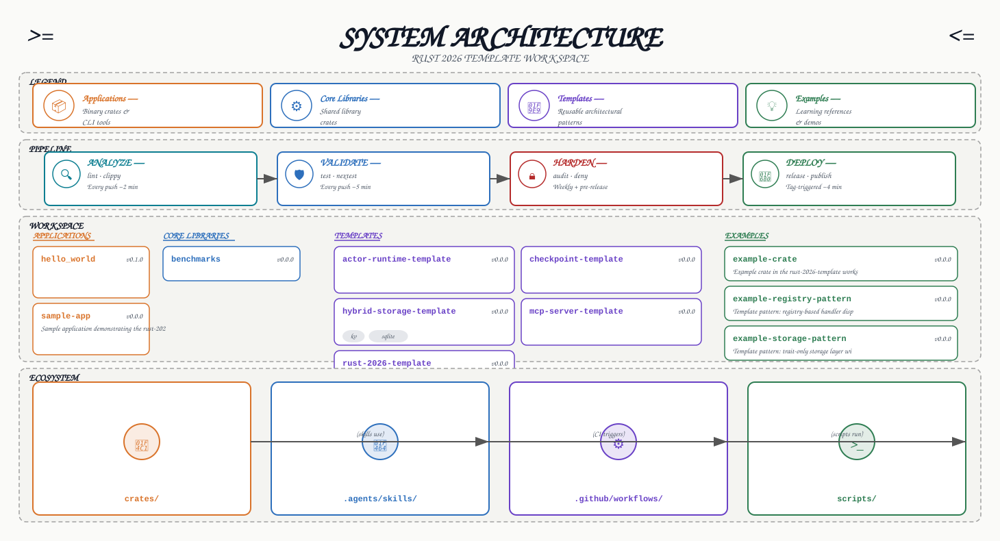

# Architecture



## Overview

This diagram shows the complete system architecture of the Rust 2026 Template workspace in a **1200px landscape format** with descriptions inside each element, including:

- **Pipeline Orchestration** — CI/CD stages from analysis to deployment with timing info
- **Workspace Topology** — All crates organized by layer with purpose descriptions inside each card
- **Active Skills** — Agent skills for development workflows
- **Interface Protocols** — Slash commands and tool integrations

## Crate Layers

| Layer | Crates | Purpose |
|-------|--------|---------|
| Applications | `sample-app` | Reference binary application demonstrating the workspace template |
| Core Libraries | `benchmarks` | Performance measurement andCriterion benchmarks |
| Templates | `actor-runtime-template` | Actor runtime with supervision and restart strategies |
| | `checkpoint-template` | Serializable state with versioning and file storage |
| | `hybrid-storage-template` | Backend abstraction with feature-gated implementations |
| | `mcp-server-template` | MCP server with tool trait and registry dispatch |
| | `rust-2026-template` | Main workspace template with modern tooling and CI/CD |
| Examples | `example-crate` | Basic example crate |
| | `example-registry-pattern` | Registry dispatch pattern example |
| | `example-storage-pattern` | Storage abstraction pattern example |
| | `hello-world-example` | Simple hello world example |

## Dependency Flow

Dependencies flow upward only: examples → templates → core → applications. This is enforced by `cargo deny`.

## Diagram Features

- **Descriptions inside elements** — Each crate card includes its purpose description
- **Feature badges** — Cargo features displayed as visual badges inside cards
- **Dependency counts** — Number of internal dependencies shown on each card
- **Pipeline timing** — Estimated CI/CD stage durations
- **1200px landscape** — Optimized for web display and README embedding

## Regenerating the Diagram

```bash
python .agents/skills/architecture-diagram/scripts/generate_diagram.py --root . --out .template/architecture.svg
cp .template/architecture.svg docs/src/architecture.svg
```
